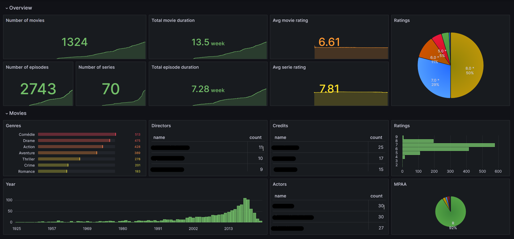

# media-dashboard

Get some stats from your exported Kodi / Synology VideoStation media library



## Installation

After installing poetry, just run the following command in the project root:

```sh
poetry install
```

## Usage example

This repository contains many commands to manage and launch the media dashboard as well as
exporting your media library to a Kodi:

- Exporting .vsmeta to NFO files

    ```txt
    poetry run python app.py dump_for_kodi FILE_OR_DIR_PATH_TO_PROCESS
    ```

- Indexing NFO files to a SQLite database

    ```txt
    poetry run python app.py update_media_database  [NFO_OR_DIR_PATH_TO_PROCESS ...]
    ```

    > **Info**
    >
    > - The SQLite database must be specified in a configuration file,
    >   see [here](tree/main/tests/media_dashboard/update_media_database/test_config.env) for an example.
    >
    > - File on `MediaDatabase__db_path` must exists.
    >   You can create an empty file at this location to initialize, the media scanner automatically runs
    >   the migration to initialize the database.

- Launching the media dashboard of the media SQLite database specified in the configuration file:

    ```txt
    poetry run python app.py launch_media_dashboard
    ```

    > **Info**
    >
    > - You must have docker installed on your system to run this command
    > - To customize the Grafana service, edit the `docker-compose.yml` located in `media_dashboard/templates/grafana`
    > - The default credentails are admin / admin

## Release History

- V0.0.1
  - Extract media-dashboard from movie-pipeline repository
